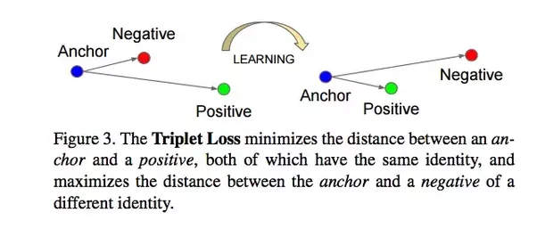
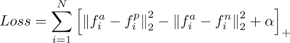
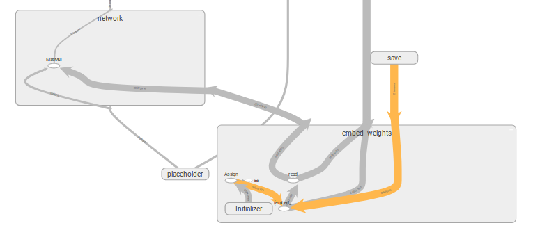
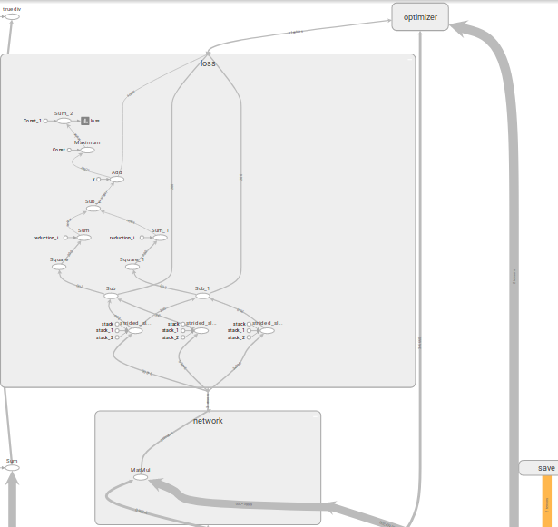
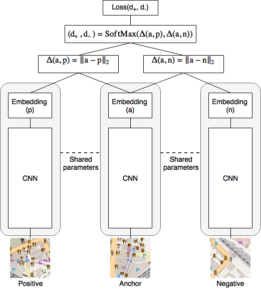
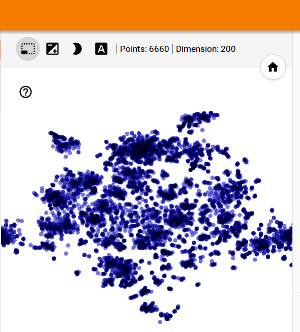
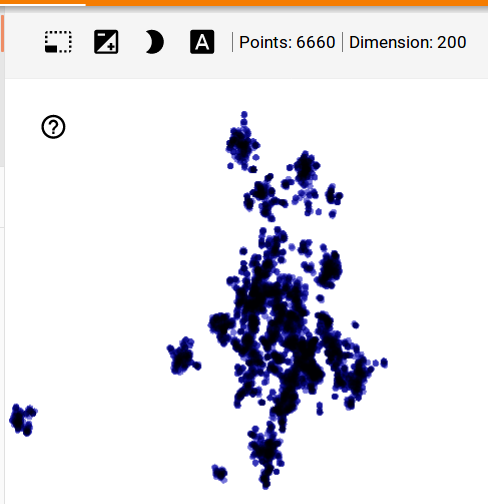
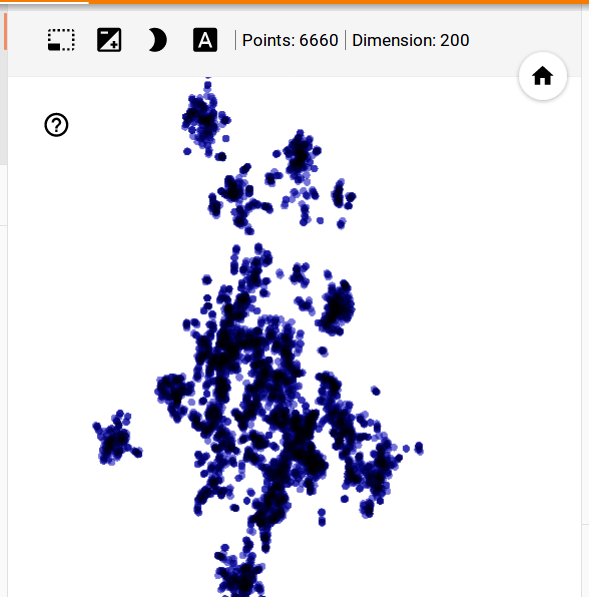
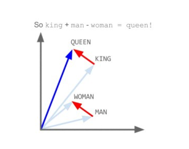

Triplet Loss is a self-supervised technique introduced in FaceNet for facial recognition. It has been used in One Shot Learning Siamese Network for facial recognition.
It has not been used for directly into Word-Embeddings.
The idea is to use this loss from FaceNet to obtain better clustering by building a cost function which minimizes the distance(Euclidean generally) between (Anchor, Positive) and maximizes distance between (Anchor, Negative), keeping a margin 'alpha' 
so to avoid embeddings collapse.

# Table of Content

--> Data Pre-Processing 
&nbsp;&nbsp;&nbsp;&nbsp;&nbsp;&nbsp;|-- Data Pre-Processing has not been included due to some reasons 
--> Word-Embeddings with Word2Vec 
--> Self-Supervised Word-Embeddings with Triplet Loss 
&nbsp;&nbsp;&nbsp;&nbsp;&nbsp;&nbsp;|-- Triplet Loss Description 
&nbsp;&nbsp;&nbsp;&nbsp;&nbsp;&nbsp;|-- Reason to choose triplet loss 
&nbsp;&nbsp;&nbsp;&nbsp;&nbsp;&nbsp;|-- Triplet Mining 
&nbsp;&nbsp;&nbsp;&nbsp;&nbsp;&nbsp;|-- Network to learn from Triplet Loss 
&nbsp;&nbsp;&nbsp;&nbsp;&nbsp;&nbsp;|-- Set of skills rather than single skill 
&nbsp;&nbsp;&nbsp;&nbsp;&nbsp;&nbsp;|-- Advantage of context vectors 
&nbsp;&nbsp;&nbsp;&nbsp;&nbsp;&nbsp;|-- Results 
--> Increasing Vocab with Pre-trained Word2Vec 
&nbsp;&nbsp;&nbsp;&nbsp;&nbsp;&nbsp;|--  
--> Tf-Idf for Triplet Mining 

# Data Pre-Processing

NOTE: DUE TO DATA PRIVACY REASONS, DATA PREPARATION PART HAS NOT BEEN UPLOADED.
  SAVED MODELS FOR WORD2VEC AND CNN HAVE ALSO NOT BEEN UPLOADED. 

# Word-Embeddings with Word2Vec

a. In order to improve the results, strategy is to make a clean and precise keyskills embeddings, which will only have keyskills from
demand and supply in vocab.
    
    Vocab_Length: 6600 

b. To obtain initial embeddings for the keyskills, for each pair of demand, supply skills are clubbed together and are considered as context for
training word2vec embeddings in Gensim.

    Context_Size: 7
    Embeddings_Dimesnion: 200
    
    Code_File: word2vec_embedding_skills_1.py,  word2vec_embedding_gensim_model.py,  word2vec_embedding_visualize.py
    Generated_file: trained_word2vec/model.w2v
    
c. The purpose of building this embeddings is to serve as an encodding for each skills which is going to be used in the next model to enhance the embedding space.
Also having a lot of information in the embedding space other than keyskills will lead to noise in the final keyskills prediction results

# Self-Supervised Word-Embeddings with Triplet Loss

TRIPLET LOSS DESCRIPTION

a. Triplet Loss is a self-supervised technique introduced in FaceNet for facial recognition. It has been used in One Shot Learning Siamese Network for facial recognition.
It has not been used for directly into Word-Embeddings.

b. It relies on triplets which are as - Anchor, Positive and Negative. Here, an anchor is choosen from the training set and another sample which is similar to anchor and ought to be closer to 
anchor is choosen from training set as Positive. Another sample is choosen which is meant to be differentiated from anchor and is the Negative.

c. The idea is to build a cost function which minimizes the distance(Euclidean generally) between (Anchor, Positive) and maximizes distance between (Anchor, Negative), keeping a margin 'alpha' 
so to avoid embeddings collapse.

d. A network is used to generate complex encoding for each of the Anchor, Positive, Negative (usually a CNN architecture for face recognition), and distance, loss is computed on them.
Loss then updates the weights accordingly to obtain optimized embeddings / learn the function which classifies.

REASON TO CHOOSE TRIPLET LOSS

a. Here I have choosen triplet loss to improve the embeddings generated from word2vec using the recruiter anotated data.

b. As we have supplies annoted as good and bad supplies, we can use it through triplet loss

TRIPLET MINING

a. It's very important to effectively select the triplets, else the model will easily overfit and not give good results.
Based on the definition of the loss, there are three categories of triplets:

    easy triplets: triplets which have a loss of 0 ,because d(a,p)+margin<d(a,n)
    
    hard triplets: triplets where the negative is closer to the anchor than the positive, i.e. d(a,n)<d(a,p)
    
    semi-hard triplets: triplets where the negative is not closer to the anchor than the positive, but which still have positive loss: d(a,p)<d(a,n)<d(a,p)+margin
    

b. I am here considering semi-hard triplet as well as hard-triplets for training. 

c. A list of valid demand id is first generated which generated and from a random choosen valid demand, 
  a skill is picked from 3,4 resume relavancy group and positive is also selected from that group.Negative is selected from respective 1,2 resume_relavancy group. 

NETWORK TO LEARN FROM TRIPLET  LOSS

a. First the embeddings from word2vec model is extracted to be used as initial encodings for our further training data. These embeddings are used to initialize the weight of the network
  which will update these embeddings with triplet loss
  
    Code_File: triplet_loss_model/word2vec_embedding_gensim_vector_extraction.py
    Created_File: trained_word2vec/model_embeddings.w2v.npy,  trained_word2vec/model_vocabs_dicti_dump.dicti

a. A single layer network is created using tensorflow (similar to skip gram) where weights are initialized with the embeddings obtained from previous word2vec model.
    
    Weight_shape: [Vocab_size, Embedding_dimension]

    
b. One-hot vectors of the anchor, positive and negative generated triplet are horizontally stacked and fed as input to model

    Input_shape: [3, Vocab_size]

c. The network layer multiplies the weight with input to generate encoding for each anchor, positive and negative.

    Hidden_layer: [3, Vocab_size] X [Vocab_size, Embedding_Dimension] = [3, Embedding_Dimensions] <- Encoding for (anchor, positive, negative)
    Code_File: triplet_loss_model/triplet_loss_embedding_tensorflow_corrected.py
    Created_File: saved_model/improved_embeddings_with_triplet_loss.npy
    

    
d. Loss is computed from the above 3 encodings and the optimizer tunes the weights for loss minimization.

    

e. Thus, finally obtained weight matrix is the new embeddings enhanced by triplet_loss.

EMBEDDING VISUALIZATION

a. Embeddings obtained from word2vec. 2D plotted with T-SNE 11000 Epochs.

b. Embeddings after using self-supervised Triplet Loss

# Inferring skills from a set of skills

SET OF SKILLS RATHER THAN SINGLE SKILL

a. The real challenge in generating inferred skills for a demand is that the generated skills should be based on the overall type of skills not only on one skill.
    For instance,
    
Java is used in android as well as in big data/hadoop. Hence the overall primary skills will indicate which side our inferred skills should incline to.

ADVANTAGE OF CONTEXT VECTORS

a. As we have generated 200-D vectors which represent the context, we have the advantage of simply adding up the vectors to attain the overall vector which would
 represent the overall context which we mean to extract. 
 Just like it is proved in the well known 'king' - 'man' + 'woman' = 'queen' example.
 
 

b. Thus here for a set of skills given, I am adding up their corresponding vectors to obtain a overall vector which I am then using to find out 'n' number of inferred skills
 which are required to be produced.
 
 RESULTS
 
 a. Here we will compare only results from initial word2vec model and self-supervised triplet loss model
  as Co-Occurrence matrix is a frequency based approach, it would not support this kind of addition to obtain overall context.
  
  
&nbsp;&nbsp;&nbsp;&nbsp;&nbsp;&nbsp;WORD2VEC&nbsp;&nbsp;&nbsp;&nbsp;&nbsp;&nbsp;|&nbsp;&nbsp;&nbsp;&nbsp;&nbsp;&nbsp;TRIPLET LOSS

# Increasing Vocab with Pre-trained Word2Vec

a. Current vocab is built on unique keyskills extracted from recruiter's data only. Hence, I'm using the custom pre-trained word2vec on large amount of data from 
  sources.
    Current_vocab_size: 6,600
    New_vocab_size: 4,07,093
    
    Code_file: word2vec_embedding_gensim_vector_extraction_huge_vocab.py
    Created_file: trained_word2vec_huge_vocab/dhcl_word2vec_model_300_embeddings, &nbsp; trained_word2vec_huge_vocab/dhcl_word2vec_model_300_vocabs_dicti_dump.dicti
    
    
b.  Model is trained again, initializing with the new Word2Vec.

    Code_File: triplet_loss_embedding_tensorflow_corrected_huge_vocab
    Created_File: saved_model_huge_vocab/improved_embeddings_with_triplet_loss_huge_vocab.npy
    
# TF-Idf for triplet Mining

a. To capture the co-occurrence importance of skills, tf-idf is used for triplet selection. For each demand, project skills from each supply is considered as one document. 
Say for a demand, we have 20 supplies, hence we have 20 documents. Tf-idf is computed for each skills, and then skills are sorted in descending order of their tf-idf score,
    
    Code_File: keyskills_extraction_demand_supply_count_tf_idf.py
    Created_File: demand_supply_resume_relavancy_data_project_skills_tfidf.dicti
    
b.  At the time of training with tripet loss, positives and negatives to anchor are selected from top 10 tf-idf score sorted skills.

    Code_file: triplet_loss_embedding_tensorflow_corrected_huge_vocab_tfidf.py
    Created_file: saved_model_huge_vocab_tfidf/improved_embeddings_with_triplet_loss_huge_vocab_tfidf.npy
    
